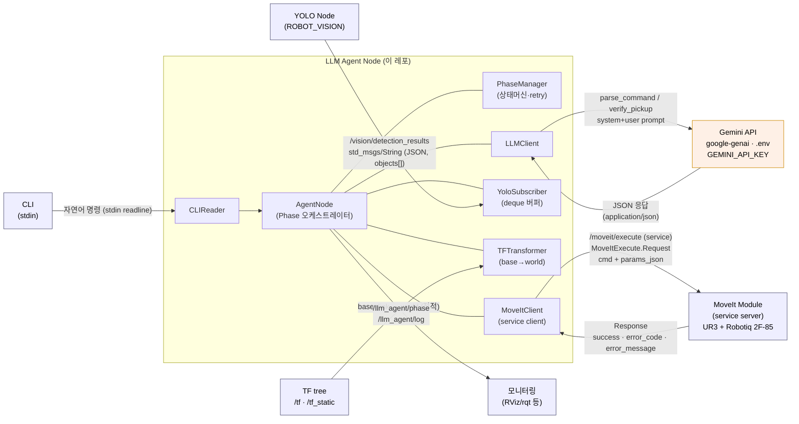
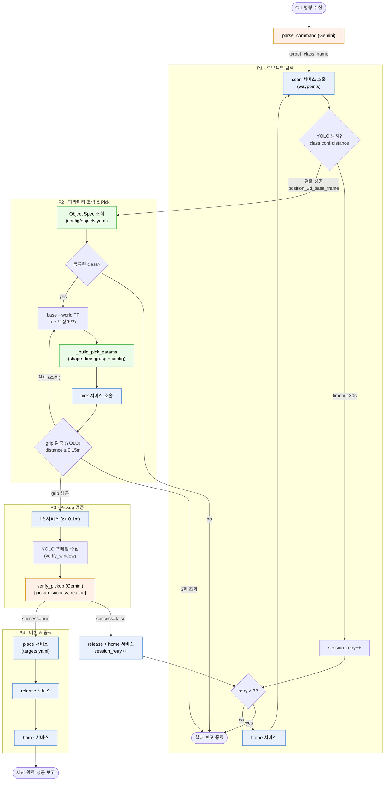

# LLM Agent 아키텍처 그래프

> 갱신된 설계(UR3 + Gemini + 서비스 기반 MoveIt) 기준.
> 관련 문서: `DESIGN.md`(상세), `MOVEIT_INTERFACE.md`(MoveIt 계약), `CONTEXT.md`(현황)

---

## 1. 주변 노드와의 인터페이스 구조

| 채널 | 방향 | 타입 | 비고 |
|------|------|------|------|
| stdin | CLI → Agent | text | 자연어 명령 |
| `/vision/detection_results` | YOLO → Agent | `std_msgs/String`(JSON) | `objects[]`, `position_3d_base_frame` |
| `/tf`,`/tf_static` | TF → Agent | `tf2_msgs/TFMessage` | `base_link`→`world` 정적변환 |
| `/moveit/execute` | Agent ↔ MoveIt | `llm_agent_msgs/MoveItExecute` (**service**) | agent=client |
| Gemini API | Agent ↔ Google | HTTPS(google-genai) | `.env` GEMINI_API_KEY |
| `/llm_agent/phase`,`/llm_agent/log` | Agent → 모니터 | `std_msgs/String` | 상태 발행 |

---

## 2. Phase별 내부 데이터 플로우

### 데이터 산출물 요약
| 단계 | 입력 | 처리 | 출력 |
|------|------|------|------|
| parse | 자연어 명령 | Gemini | `target_class_name` |
| P1 | target | scan 서비스 + YOLO 매칭 | `position_3d_base_frame` |
| P2 | base 좌표 + class | TF(base→world) + config Object Spec + pick 서비스 | grip 성공/실패 |
| P3 | — | lift 서비스 + YOLO 수집 + Gemini 판단 | `pickup_success` |
| P4 | place target | place/release/home 서비스 | 세션 완료 |

> **공유 retry 카운터**: P1 타임아웃 · P2 grip 실패 · P3 pickup 실패가 동일 `session_retry_count`를
> 증가시키며 3 초과 시 세션 전체 종료. (`PhaseManager`)
>
> **LLM 호출은 2곳**: `parse_command`(진입), `verify_pickup`(P3). P2 PICK 파라미터는 config 기반 결정론 조립.
